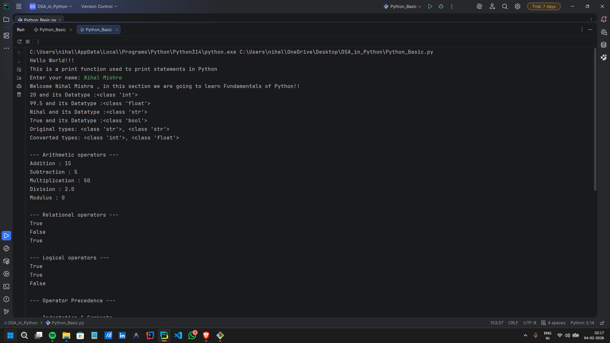
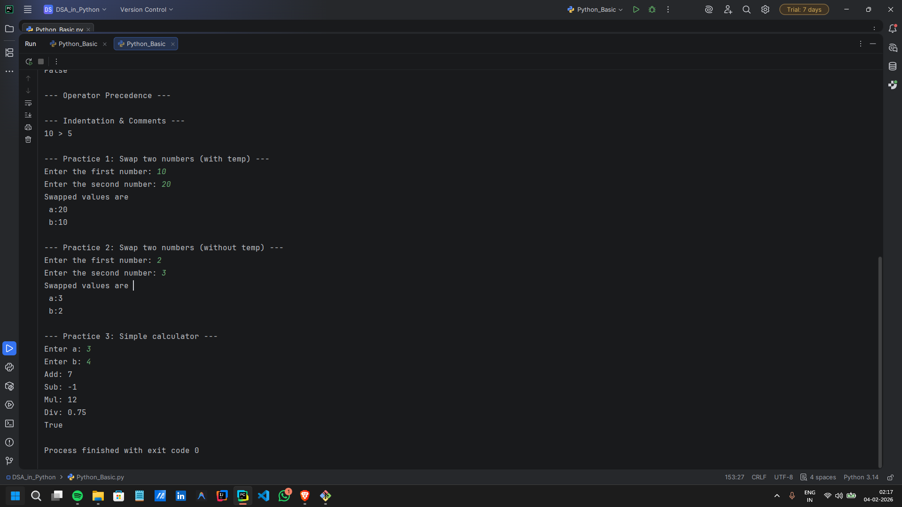

# Python Fundamentals & Practice

## 📌 Concepts Covered

The programs cover the following topics:

- **Python Program Structure** (Top-Bottom execution flow)
- **Input and Output** operations using `print()` and `input()`
- **Variables & Data Types** (`int`, `float`, `bool`, `str`)
- **Type Casting** (converting between data types like `str` to `int`)
- **Arithmetic Operators** (+, -, *, /, %)
- **Relational & Logical Operators** (>, <, ==, and, or, not)
- **Operator Precedence** and Indentation rules
- **Formatting strings** using **f-strings**

---

## 🧪 Logic & Operations Demonstrated

The following fundamental logic and algorithms are demonstrated with examples:

- **Arithmetic Logic** – Performing calculations using variables
- **Comparison Logic** – returning Boolean values (`True`/`False`)
- **Logical Gates** – Combining conditions using `and`, `or`, `not`
- **Variable Swapping** – Swapping two numbers using a temporary variable
- **Mathematical Swapping** – Swapping two numbers **without** a temporary variable
- **Calculator Logic** – Basic addition, subtraction, multiplication, and division

All examples are written in a **simple, readable, and linear format** for easy understanding.

---

## 🖥️ Output

Each program prints results directly to the console, showing the effect of each operation step by step.

Sample console outputs are shown below:

### Part 1: Basics & Operators

### Part 2: Practice Questions (Swapping & Calculator)

---

## 📂 File Structure

- `main.py` — Complete practice program covering all fundamental concepts  
- `output1.png` — Screenshot of basics and operators output  
- `output2.png` — Screenshot of practice questions output  
- `README.md` — Documentation for this folder  

---

## 👨‍💻 Author

**Nihal Mishra** 📧 Email: nihalmishra3009@gmail.com  
🌐 GitHub: https://github.com/NihalMishra3009  
✖️ Twitter (X): https://x.com/Nihal_Mishra30  

---

## ⭐ Note

These fundamentals are the **building blocks of Python**.  
A solid understanding of variables, types, and operators is essential before moving on to **loops, functions, lists, and object-oriented programming**.
